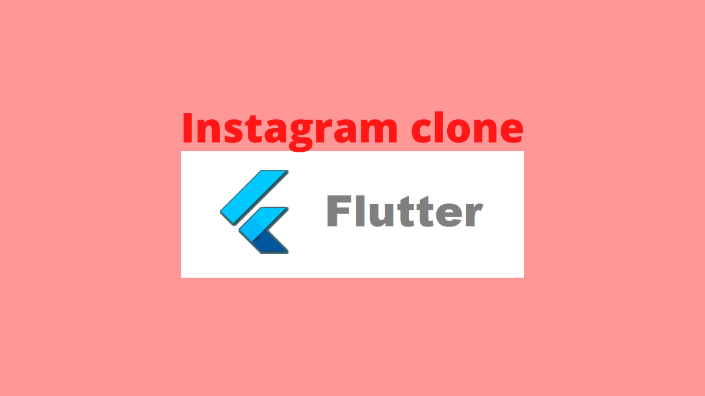
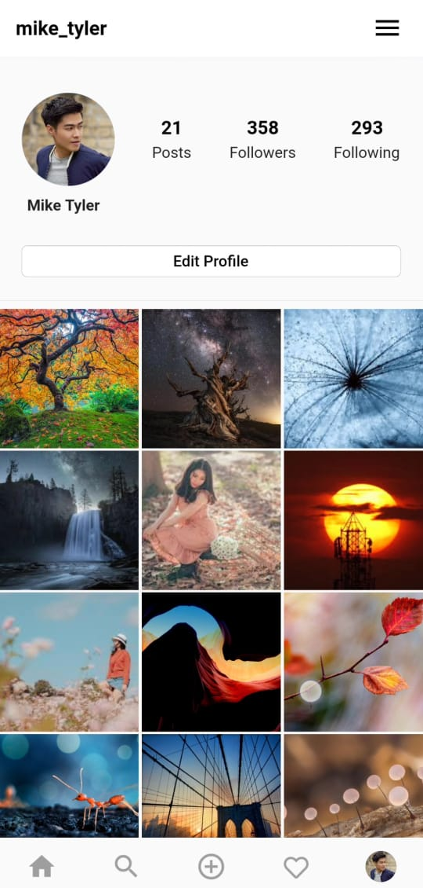
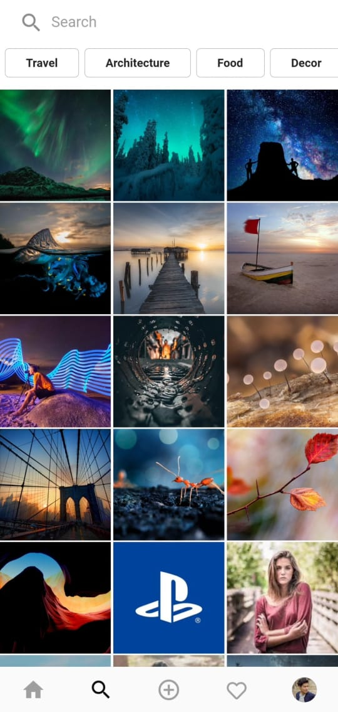
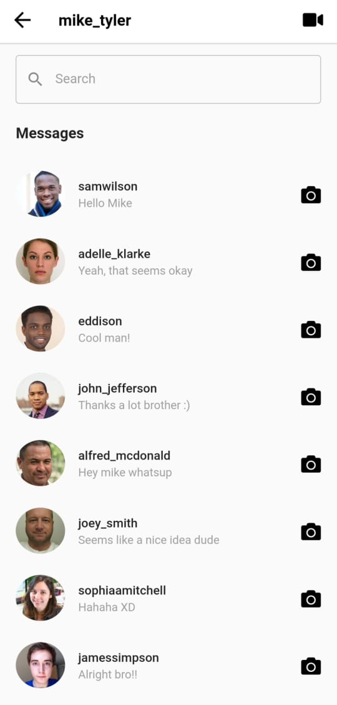
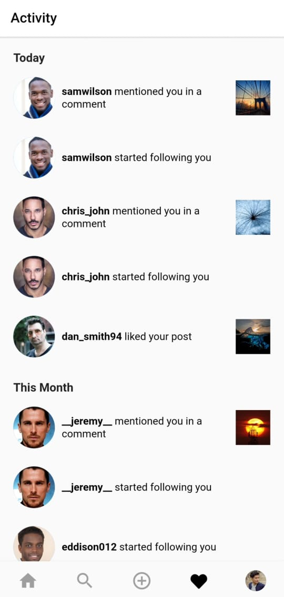
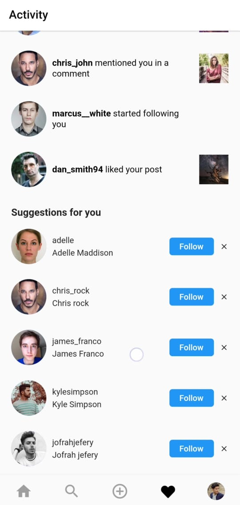

# instagram_ui_flutter   
   [](https://github.com/ahmedgulabkhan/instagram_ui_flutter)

**Star ⭐ this repo if you like what you see.**

<p></p>
<p align="center"><b>Instagram clone</b></p>

## About
A UI clone of the Instagram app that I created using Flutter.

## Snapshots

| Home Page | Profile Page |
|------|-------|
|||

| Search Page | Messages Page |
|------|-------|
|||

| Activity Page | Activity Page |
|------|-------|
|||


## Configuration Steps
1. Cloning the repository:

```
$ git clone https://github.com/ahmedgulabkhan/instagram_ui_flutter.git
```

2. Open the project:

`$ cd instagram_ui_flutter`

3. Install the dependencies related to the project

`flutter pub get`

4. Now run the app on your connected device (using terminal):

`$ flutter run`

## Author(s)

[Ahmed Gulab Khan](https://www.github.com/ahmedgulabkhan)

## Other Flutter Projects

- [GroupChatApp](https://www.github.com/ahmedgulabkhan/GroupChatApp)  
- [Foodspace](https://www.github.com/ahmedgulabkhan/Foodspace)  
- [facebook_ui_flutter](https://www.github.com/ahmedgulabkhan/facebook_ui_flutter)  
- [Atlas](https://www.github.com/ahmedgulabkhan/Atlas)  
- [GitTrends](https://www.github.com/ahmedgulabkhan/GitTrends)  
- [youtube_clone_flutter](https://www.github.com/ahmedgulabkhan/youtube_clone_flutter)  
- [SnakeGameFlutter](https://www.github.com/ahmedgulabkhan/SnakeGameFlutter)  
